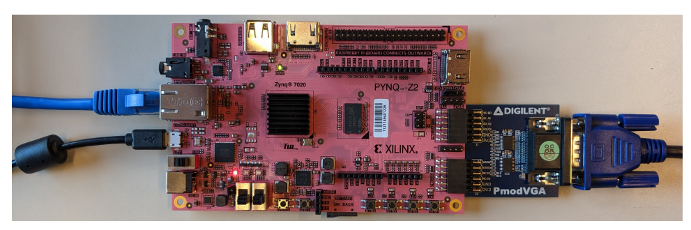

# The PONG Project

## 1) Project Description
This project involves the development of a **PONG** game enhanced with a **Mandelbrot fractal** background. The project uses the **PYNQ-Z2** board.

## 2) Repository Contents

- **constr**: Constraint files for setting up the FPGA project.
- **pynq**: Files and scripts for interfacing with the PYNQ-Z2 board.
- **src**: VHDL source files and modules used in the project.
- **vivado_project**: Vivado project files, including the design implementation.
- **work_lab8_mandelbrot**: Pre-built files for the Mandelbrot project, containing intermediary and final work.
- **README.md**: This documentation file.

### Bitstream file (.bit)
For direct download to the FPGA:  
`lab08_mandelbrot/vivado_project/project_final.runs/impl_1/mandelbrot_top.bit`.

## 3) Hardware Requirements
To deploy and test this project, you will need the following hardware:

- PYNQ-Z2 Xilinx board.
- PC to host and run the Vivado Design Suite.
- Micro USB cable to power the FPGA board.
- Ethernet cable for programming the FPGA.
- Digilent PMOD VGA interface for connecting a VGA cable to the FPGA board.
- Monitor with a VGA port to display the game output.

## 4) Software Prerequisites

- **Vivado 2020.2**, or install the version compatible with your FPGA.

## 5) Instructions

1. Clone this repository to your local machine:
    ```bash
    git clone <repository-url>
    ```

2. Open Vivado and create a new project.

3. Import the provided source files.

    > **Note:** Depending on your deployment setup, you may need to adjust the file paths within the project to match your file structure.

4. Synthesize, implement, and generate the bitstream (or use the already generated bitstream file).

5. Program the FPGA using the provided `.bit` file.

---

**Date**: December 2024  
**Prepared for**: EPFL EE-334 Digital System Design Project Hosted by the TCL.  
**Authors**: Thomas Lenges & Renuka Singh Virk

## Acknowledgements
The authors would like to thank the **TCL (Telecommunications Circuits Lab)** at EPFL for its support, resources, and guidance throughout the development of this project.

## Figure 1: PONG Game with Mandelbrot Fractal Background


*Figure 1: The PONG game running on the PYNQ-Z2 board with the Mandelbrot fractal background displayed on the monitor.*

## Figure 2: Full project schematic with background frame buffer receiving X- and Y-coordinates
from the VGA controller to output the correct pixel values for the PONG background.


*Figure 1: The schematic diagram illustrating the background frame buffer and VGA controller interaction for rendering the PONG game's background.*

---

## Figure 4: FPGA board connected with PMOD VGA, USB, Ethernet, and a VGA cable.



*Figure 4: The FPGA board setup, showing the connections to the PMOD VGA, USB, Ethernet, and VGA cable. For those using VGA to HDMI adapters, the setup is the same with the adapter connected to the PMOD VGA module.*

The last two figures and descriptions, **Figure 2** and **Figure 3** belong to the **TCL (Telecommunications Circuits Lab)** at EPFL.
